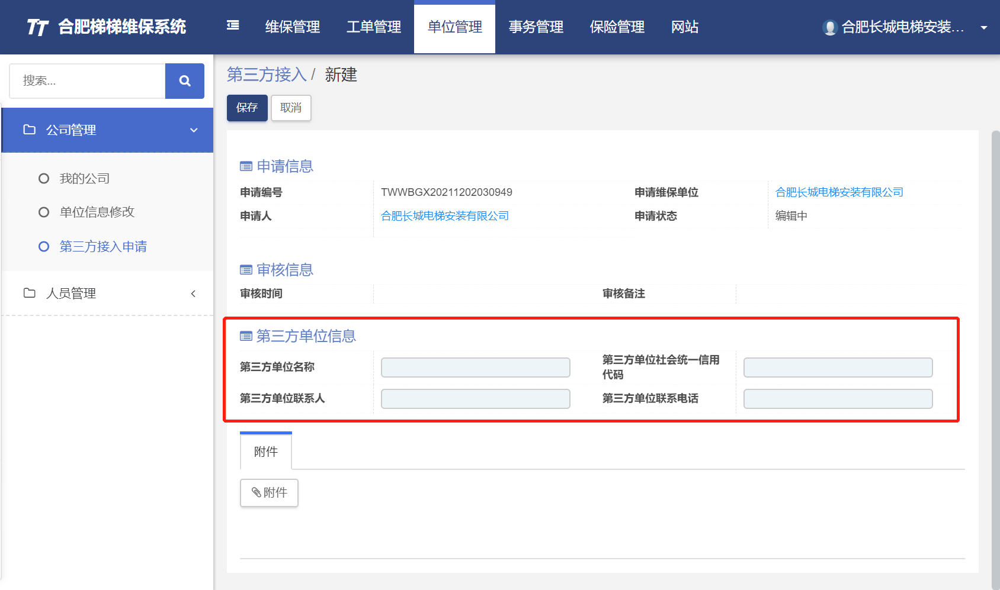
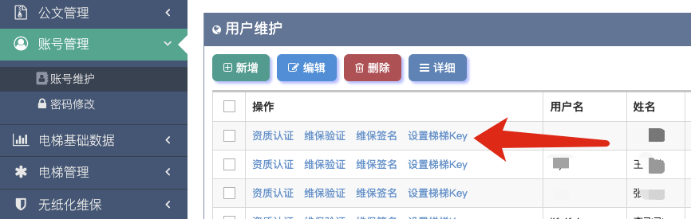
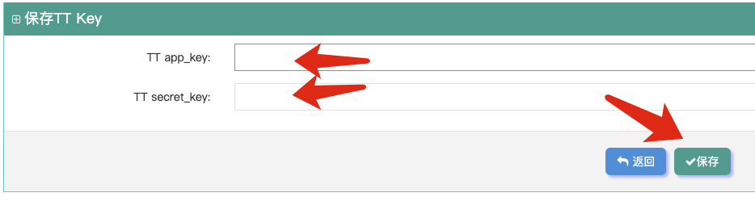

## 绑定梯梯的 api_key 到账号
### 1. 先到梯梯的网站申请，网页地址：https://hefei.titi365.com/

#### 填写内容：
名称 | 内容
--- | ---
单位名称 | 深圳市梯信通技术有限公司
信用代码 | 宋晓伟
联系人 | 91440300MA5DKLCE5P
联系电话 | 0755-26711576

### 2. 绑定 api_key ，网页地址：http://onedt.com.cn/OneSYS/Account/Login

#### 填写好后点击保存即可。

### 3. APP功能修改
- 安徽地区需要在APP上选择“合肥”进行维保操作。
- 由于梯梯接口原因，维保的电梯在维保前需要增加一个扫码绑定功能，绑定后才可以进行维保。
- 扫的二维码是梯梯那边的电梯二维码。
- 苹果有待更新。