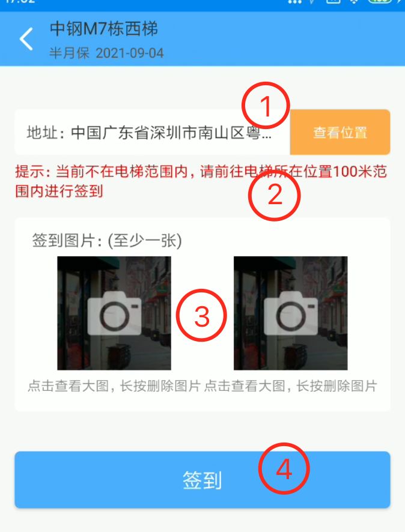
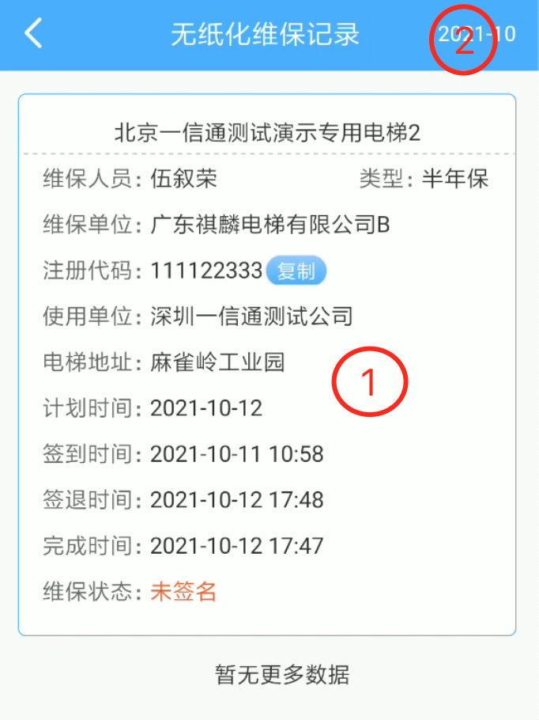

# 电梯维保APP使用说明
### 客服电话：0755-26926981
### 上班时间：工作日8:30-18:00
## 一、系统登录：
### 1、http://www.onedt.com.cn/ →点击	维保单位 →输入用户名、密码、验证码

（可以勾选记住密码）→登陆进入系统

### 2、无纸化维保
### 无纸化维保管理：维保项目管理、维保小组管理、维保纪录管理、维保纪录查询、维修纪录管理
### 无纸化维保→维保项目管理（半月、季度、半年、年度）

### 无纸化维保→维保小组管理（创建维保小组，一台电梯可以填写多个维保人员  的名单，其中任何一个成员都可以维保此台电梯）

### 无纸化维保 →维保小组管理 →新增→提交

### 无纸化维保→维保计划管理→新增维保计划、维保预警

新增维保计划：起止时间要注意（从起始时间开始创建一年的维保计划，且最后一个计划为年度维保，比如说目前还有 3 个月到一年，往前推 9 个月，填上这个时间）

### 无纸化维保→维保计划管理→维保预警

### 无纸化维保→维保纪录查询

### 维保纪录查询后可以打印

### 维保纪录查询→ 可导出（在选择打印机的时候 选另存为），如不需要导出，则直接点打印

### 无纸化维保→维修纪录的管理

## 二、APP下载
### 1. 统一下载地址：[https://app.dtaq.ltd/web/app.html](https://app.dtaq.ltd/web/app.html)

### 2. 打开后的页面：
- 选择“维保APP”。
- 选择自己手机对应的系统点击下载。

### 3. 安装好后的APP：

## 二、APP第一次打开演示
### 1. 打开APP
#### 第一次打开会有一个启动页，从右往左滑就可以了。

#### 滑动到最后一个页面，会有一个按钮，点击按钮就可以进入到首页了。

#### 这些必要的权限需要允许一下，不然部分功能无法使用。

#### 第一次需要进行一个地区选择，如果发现没有自己的地区请选择（通用）。

### 2. APP登录
#### 第一步，点击首页左上角的图标，拉出侧滑菜单。

#### 第二步，点击侧滑菜单的头像，打开登录页面。

#### 第三步，输入登录账号和密码，点击登录。

#### 第四步，登录成功后回到首页就可以看到维保模块和应急模块了。

## 三、头部模块介绍
### 1. 电梯报异

#### ① 填写电梯异常的内容，例如电梯不关门或者楼层不显示等等。
#### ② 扫码或填写应急救援吗，扫码是扫描我们标识牌上的二维码，扫码后会显示电梯名称，应急救援识别码也是标识牌上面的应急识别码。

#### ③ 拍照上传电梯异常位置。
#### ④ 点击提交，上传异常信息。
### 2. 紧急求救

#### ① 当前地址显示，这里显示手机当前的位置。
#### ② 扫码或填写应急救援吗，扫码是扫描我们标识牌上的二维码，扫码后会显示电梯名称，应急救援识别码也是标识牌上面的应急识别码。（同上）
#### ③ 点击提交，发送求救信息。
## 四、维保模块介绍
### 1. 维保计划

#### ① 计划日历，带红色圆点和数字的表示这天有几个计划。
#### ② 电梯和计划的一些基本信息显示。
#### ③ 当前的维保状态，显示当前的维保工作做到哪一步。
#### ④ 点击图标弹出筛选框。
### 1.1 筛选框

#### ① 切换搜索或筛选。
- 搜索：点击搜索后单次搜索，内容清空。
- 筛选：内容不清空，点击其他日期可进行筛选。

#### ② 筛选内容，支持模糊筛选。
### 1.2 人脸验证
#### 每次打开APP时需要验证，验证后不退出登录或不退出APP不用再次验证。

#### 注：在做任何操作前都需要先进行人脸验证，验证通过才能往下走。
### 1.3 维保签到

#### ① 当前手机的位置，查看位置可以查看电梯的位置和当前自己的位置，签到时会上报当前的位置信息到后台。
#### ② 当前的位置和电梯的位置较远会出现这个提示，如果是因为电梯位置不正确导致，可以复制这台电梯的注册代码给自己公司的文员进行清零重置（重置后需要回到APP的首页再进入维保计划）。不重置也可以进行强制签到，如下图：

#### ③ 现场图片，至少需要一张，根据公司或质监局要求进行拍摄。
#### ④ 完成上述要求后可点击进行签到。
### 1.4 维保

#### ① 维保项显示。
#### ② 出现绿色拍照按钮说明当前维保项需要进行拍照。
#### ③ 点击弹出维保选项，每个地区的维保选项会存在差异，根据实际情况进行选择；示例图：

#### ④ 一键选择，可一键设置所有选择项为第一个选项。如图：

#### ⑤ 空白项，需要填写项，点击后出现弹框，在弹出框输入后点确定即可。

#### ⑤ 完成所有维保项之后才能点击提交，没有完成的项会弹出提示，在井道里信号不好或者做完的维保项不小心点了返回咋办？不用担心，重新进入后会回显，数据会缓存的。
### 1.4 维保签退
- 签退无需任何操作，点击签退按钮即可。
- 签退也会上报当前的定位信息。

### 1.5 签字说明
- 签字需要两个人进行签字，一个是维保员，一个是使用单位安全管理员，自己负责维保的不需要签字。
- 维保员在APP上签字，安全管理员需要打开维保员分享的链接进行签字。
- 例如：有A、B、C三个人，A、B是维保员，C是安全管理员。A给电梯做了维保，就需要B和C签字，反过来B做了维保，就是A和C签字。

### 1.5.1 维保员签字
#### APP首页-维保计划-找到需要签字的计划-点击后跳转到维保详情-滑动到底部

#### 签字后点击提交即可。
### 1.5.2 使用单位安全管理员签字

#### 进入到分享页面

#### 进入后如果没有安全管理员，点击右上角图标进行添加

#### 输入安全管理员的基本信息即可，添加后点击安全管理员

#### 出现弹框说明链接已经复制到粘贴板，可以打开微信发送给安全管理员进行签字。
## 1.6 电梯暂停维保
### 根据疫情影响或者出现不可抗拒因素，导致使用单位电梯不能按时、按计划进行维保，维保员可在手机APP上进行“申请暂停”维保电梯。系统会自动发送至平台监管单位进行审核处理。

#### ①选择暂停维保时间段；填写申请原因；填写情况说明；拍照现场图片发送链接给使用单位管理员签名；
#### ②监管单位登录系统后台，选择无纸化维保--暂停维保审核功能；对企业提交上来的维保暂停申请进行查看详细原因，判断审核通过或不通过，并说明原因。

### 2. 电梯维修

#### ① 扫码是扫描我们标识牌上的二维码，扫码后显示电梯名称。
#### ② 选择时间和填写维修信息。
#### ③ 点击提交，上传维修信息。

### 3. 维保记录

#### ① 维保记录简要，点击查看维保详情。
#### ② 点击弹出日期选择框选择要查询的月份。

### 4. 维修记录

#### ① 维修记录简要，点击查看维修详情。
#### ② 点击弹出日期选择框选择要查询的月份。

### 5.电梯列表

#### 主要显示当前所负责的电梯数量以及电梯基本信息。暂停记录
### 6.暂停记录

#### 主要是查看申请暂停维保的审核结果详情。